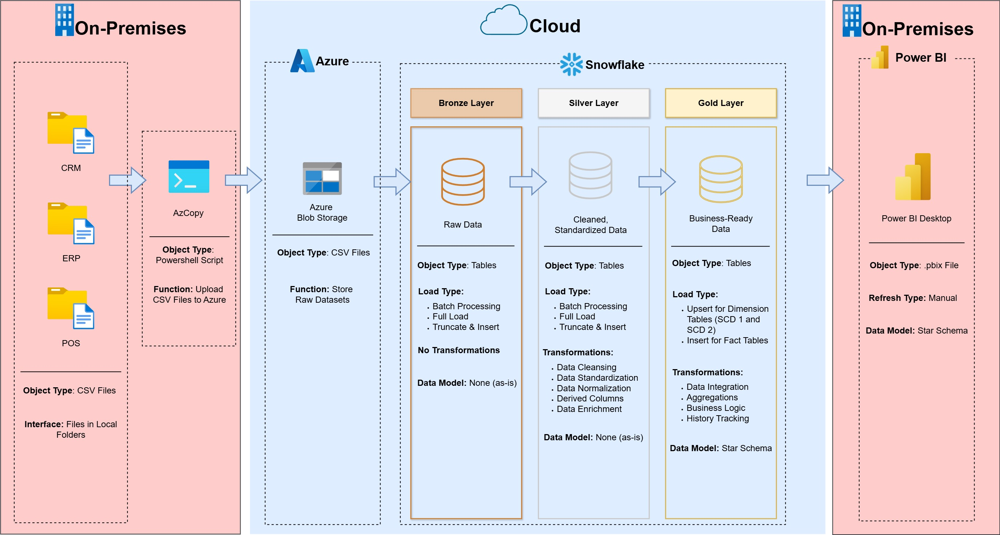

# **Case Study: Snowflake Data Engineering Project**  

Welcome to the **Snowflake Data Warehouse and Analytics Project**! ❄️🚀  

This project showcases an end-to-end data engineering and analytics pipeline on **Snowflake**, with datasets designed to replicate a **retail transactional system**.

The goal is to demonstrate **real-world data warehousing concepts**, **medallion architecture**, and **best practices for ETL pipelines** while producing high-quality, cost-efficient, and business-ready analytics.


> **Disclaimer & Shoutout:**  
> This project was **inspired by the original SQL Data Warehouse Project** created by [**Baraa Khatib Salkini (Data With Baraa)**](https://www.youtube.com/@datawithbaraa).  
> Baraa’s project served as the foundation and inspiration for this work.  
> This Snowflake version attempts to add **more complexity** with **12-month datasets, SCD1/SCD2 tracking, Azure Blob integration, and automated ETL**.  
>  
> If you want to learn the fundamentals of data warehousing, **go check out his amazing work!**  
> - **YouTube:** [Data With Baraa](https://www.youtube.com/@datawithbaraa)  
> - **GitHub:** [Baraa’s SQL Data Warehouse Project](https://github.com/DataWithBaraa/sql-data-warehouse-project)  
> - **Website:** [www.datawithbaraa.com](https://www.datawithbaraa.com)

---

## **🏗️ Data Architecture**  

We are following the **Medallion Architecture** (Bronze, Silver, and Gold layers) built on **Snowflake**:  


1. **Bronze Layer**: Raw data landing zone (POS, CRM, ERP datasets) as ingested from **local CSV files** into **Azure Blob Storage** using **AzCopy**.  
2. **Silver Layer**: Cleansed, standardized, and conformed data (joins, deduplication, validation).  
3. **Gold Layer**: Business-ready, analytics-optimized **star schema** (fact & dimension tables) with tracking of historical changes.

---

## **📖 Project Overview**  

This project involves:  
1. **Data Simulation**: Generating realistic transactional datasets for POS, CRM, ERP, and product categories.
2. **Batch Data Loading**: Loading of monthly snapshot data in batch.
3. **ETL Pipelines**: Transforming Bronze data into Silver and Gold layers using Snowflake SQL.  
4. **Data Modeling**: Designing a **star schema** with **fact tables** (e.g., sales) and **dimension tables** (e.g., customers, products, stores).  
5. **Analytics & Reporting**: Building dashboards for insights such as **customer behavior**, **product performance**, and **sales trends**.

---

## **🚀 Project Requirements**  

### **Data Simulation & Local Storage**  
- **Monthly CSV Snapshots** (January 2023 - January 2024) are stored in **local folders** before being uploaded to the cloud.  
- **AzCopy + PowerShell Scripts** are used to upload these snapshots to **Azure Blob Storage**, from where Snowflake **stages** them for ingestion.  
- This simulates a **real-world landing zone workflow** where local files are batch uploaded into cloud storage for processing.
- Reporting is done locally using Power BI Desktop to minimize cost.
---

### **Datasets**  
I asked ChatGPT to generate 12 months of realistic data with the following specifications:  

#### **CRM Datasets**  
- **`cust_info`**: Master list of customers with attributes such as `marital_status`, `gender`, `loyalty_join_date`, and `preferred_store`.  
- **`cust_az12`**: Demographic details (e.g., birthdate, gender).  

#### **POS Dataset**  
- **`sales_details`**: Transactional sales data including `quantity`, `sales`, `price`, `points`, `payment_channel`, and `store_id`.  

#### **ERP Datasets**  
- **`prd_info`**: Product master, including `product_name` and `product_price` (with **SCD2 changes** for price).  
- **`px_cat_g1v2`**: Product categories and subcategories.  
- **`stores`**: Store information, names, and locations.

---

### **Dummy Data Rules**  
- **80/20 Split**: 80% clean data, 20% with intentional issues (duplicates, inconsistent genders and values, mismatched primary keys, spaces, etc.).  
- **SCD2 & SCD1**:  
  - Products: Price changes (SCD2) occur 1–3 times over 24 months.  
  - Products: Name changes (SCD1) simulated.  
  - Customers: Marital status or loyalty join dates may change once in 24 months.  
- **Snapshots**:  
  - Monthly snapshots for all datasets (2023–2024).  
  - **sales_details**: 150k–250k transactions per month.  
  - **cust_info / cust_az12**: ~10k customers, growing 5–20% monthly.  
  - **prd_info / px_cat_g1v2**: ~300 products, growing 1–3% quarterly.

---

### **Data Pipeline Logic**  

*To be updated; Still in progress*

---

## **📂 Repository Structure**  

*To be updated; Still in progress*

```
snowflake-data-engineering-project/
│
├── datasets/                           # Raw datasets generated and stored locally
│
│
├── docs/                               # Project documentation and diagrams
│   ├── Architecture_v2.jpg             # Visual of medallion architecture
│   ├── data_catalog.md                 # Field descriptions and metadata
│
├── scripts/                            # SQL scripts for Snowflake transformations
│   ├── bronze/                         # Load raw data into Snowflake stages/tables
│   ├── silver/                         # Cleansing and conformance
│   ├── gold/                           # Star schema creation and fact/dim loading
│
├── tests/                              # Data validation scripts (row counts, integrity, etc.)
│
├── README.md                           # Project documentation (this file)
├── LICENSE                             # Project license
```

---

## **🛡️ License**  

This project is licensed under the **MIT License**.  
You are free to use, modify, and share this project with proper attribution.

---

## **🌟 About Me**  

Hi! I'm **John Marnel San Pedro**, a **Data Engineer** and solopreneur specializing in **data warehousing, ETL, and analytics**.  
I built this project to demonstrate **Snowflake-based data engineering** with realistic datasets, AzCopy automation, and best practices for ETL and Data Warehousing.
